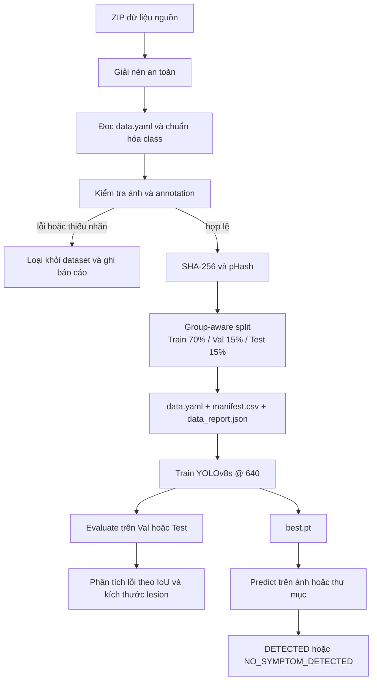

# Rice Leaf Disease Detection

[](https://github.com/haminhthong/Rice-Leaf-Disease-Detection/actions/workflows/ci.yml)
[](https://www.python.org/)
[](https://docs.ultralytics.com/)
[](LICENSE)

## Bài toán & phạm vi ứng dụng

Dự án phát hiện vùng tổn thương trên ảnh lá lúa bằng object detection với Ultralytics YOLOv8. Mô hình nhận diện hai lớp:

| Class ID | Tên trong dataset | Tên tiếng Việt |
| ---: | --- | --- |
| `0` | `Bacterial_Leaf_Blight` | Bạc lá lúa |
| `1` | `Brown_Spot` | Đốm nâu |

Phạm vi gồm chuẩn hóa dữ liệu YOLO, kiểm tra annotation, chống trùng/rò rỉ giữa các tập, huấn luyện, đánh giá, phân tích lỗi và dự đoán từ CLI. Kết quả chỉ là công cụ hỗ trợ sàng lọc trên ảnh; không thay thế chẩn đoán thực địa hoặc khuyến cáo xử lý bệnh.

## Luồng logic, luồng dữ liệu và pipeline

Toàn bộ mã nguồn, cấu hình và báo cáo tuân theo pipeline duy nhất sau:



### Luồng xử lý dữ liệu

1. `scripts/prepare_data.py` gọi `rice_leaf_detection.prepare`. Script tìm ZIP mặc định ở thư mục gốc hoặc `data/raw/`, giải nén vào `data/extracted/` bằng cơ chế kiểm tra đường dẫn an toàn.
2. Mỗi nguồn được dò `data.yaml` cùng các split ảnh/nhãn. Annotation được đọc theo định dạng YOLO; polygon nguồn được chuyển thành bounding box bao quanh, sai số biên nhỏ do làm tròn được kẹp về miền hợp lệ.
3. Ảnh được phân loại thành `valid`, `negative` hoặc `invalid`. Ảnh thiếu nhãn, nhãn sai định dạng hoặc ảnh hỏng bị loại; nhãn lớp ngoài phạm vi được ghi là hard negative trong manifest, không được biến thành nhãn mục tiêu.
4. Ảnh trùng nội dung được nhận diện bằng SHA-256. Các biến thể gần giống được gom theo `original_key` và pHash, sau đó toàn bộ group được chia cùng một split để tránh leakage.
5. Dataset sạch được ghi vào `data/processed/rice_leaf_detection/`, gồm `train/`, `val/`, `test/`, `data.yaml`, `manifest.csv` và `data_report.json`.

### Luồng huấn luyện, đánh giá và dự đoán

- `scripts/train.py` nạp `configs/default.yaml`, dùng `yolov8s`, kích thước ảnh `640`, seed `42` và ghi run vào `runs/train/<run_name>/`.
- `scripts/evaluate.py` gọi `model.val` trên `val` hoặc `test`, ghi `metrics.json`, `per_class_metrics.csv` và biểu đồ vào `runs/evaluate/`.
- `python -m rice_leaf_detection.error_analysis` ghép prediction với ground truth bằng IoU, phân loại TP/FP/FN và lỗi theo kích thước tổn thương; báo cáo nằm trong `reports/error_analysis/`.
- `scripts/predict.py` nạp `best.pt`, dự đoán trên một ảnh hoặc thư mục, lưu ảnh kết quả vào `runs/predict/results/` và in trạng thái `DETECTED` hoặc `NO_SYMPTOM_DETECTED`.

Các thư mục `data/extracted/`, `data/processed/`, `runs/` và `reports/` là output có thể tạo lại, không phải mã nguồn và không cần commit.

## Hợp đồng dữ liệu và annotation

Dataset đầu vào cần có cấu trúc YOLO với các split `train`, `valid` hoặc `val`, `test`; mỗi split có `images/` và `labels/`, cùng một `data.yaml`.

Mỗi dòng nhãn có dạng:

```text
class_id x_center y_center width height
```

Tọa độ được chuẩn hóa trong `[0, 1]`. File nhãn rỗng là ảnh `negative` hợp lệ. File nhãn thiếu hoặc có lỗi là `invalid` và bị loại khỏi dataset sạch. Chỉ hai class mục tiêu được giữ lại.

Pipeline ghi SHA-256, pHash, `original_key`, `group_id` và split vào `manifest.csv`. Bước kiểm tra cuối bảo đảm group, SHA-256 và original key không xuất hiện ở nhiều split; đồng thời ảnh và nhãn của từng split phải khớp nhau.

## Cấu trúc thư mục dự án

```text
rice-leaf-disease-recognition/
├── .github/workflows/ci.yml
├── configs/default.yaml
├── data/
│   ├── README.md
│   └── sample/
├── scripts/
│   ├── prepare_data.py
│   ├── train.py
│   ├── evaluate.py
│   └── predict.py
├── src/rice_leaf_detection/
│   ├── annotations.py
│   ├── config.py
│   ├── constants.py
│   ├── deduplication.py
│   ├── error_analysis.py
│   ├── evaluate.py
│   ├── inference.py
│   ├── predict.py
│   ├── prepare.py
│   ├── train.py
│   └── utils.py
├── tests/
├── LICENSE
├── pyproject.toml
├── requirements.txt
└── README.md
```

## Cài đặt

Yêu cầu Python 3.10 trở lên.

```bash
python -m venv .venv
```

Kích hoạt môi trường:

```bash
# Windows PowerShell
.venv\\Scripts\\Activate.ps1

# Linux/macOS
source .venv/bin/activate
```

Cài package ở chế độ editable cùng công cụ phát triển:

```bash
python -m pip install --upgrade pip
python -m pip install -e ".[dev]"
```

Nếu chỉ cần chạy pipeline, có thể cài dependency runtime bằng:

```bash
python -m pip install -r requirements.txt
```

## Chạy pipeline

### 1. Chuẩn bị dữ liệu

Đặt `RiceLeafAnnotatedDataset.zip` và `dataset1.zip` ở thư mục gốc hoặc `data/raw/`, sau đó chạy:

```bash
python scripts/prepare_data.py --overwrite
```

Có thể truyền nguồn và thư mục output riêng:

```bash
python scripts/prepare_data.py \
  --archives data/raw/RiceLeafAnnotatedDataset.zip data/raw/dataset1.zip \
  --output data/processed/rice_leaf_detection \
  --overwrite
```

### 2. Huấn luyện

```bash
python scripts/train.py --epochs 50 --batch 16
```

Các tham số mặc định lấy từ `configs/default.yaml`. Có thể ghi đè bằng `--config`, `--data`, `--model`, `--imgsz`, `--patience`, `--device`, `--workers`, `--runs-dir`, `--name` hoặc `--resume`.

### 3. Đánh giá

```bash
python scripts/evaluate.py \
  --weights runs/train/<run_name>/weights/best.pt \
  --split val

python scripts/evaluate.py \
  --weights runs/train/<run_name>/weights/best.pt \
  --split test
```

Mỗi lệnh tạo metric tổng hợp và metric theo lớp cho split được chọn.

### 4. Phân tích lỗi

```bash
python -m rice_leaf_detection.error_analysis \
  --weights runs/train/<run_name>/weights/best.pt \
  --dataset data/processed/rice_leaf_detection \
  --split val
```

Có thể điều chỉnh `--confidence`, `--iou`, `--imgsz` và `--output`.

### 5. Dự đoán

```bash
python scripts/predict.py \
  --weights runs/train/<run_name>/weights/best.pt \
  --source data/sample/bacterial_leaf_blight_sample.jpg
```

`--source` nhận một file ảnh hoặc thư mục ảnh. Dùng `--save-txt` nếu cần lưu thêm nhãn YOLO dự đoán.

## Kiểm tra cục bộ và CI

Workflow `.github/workflows/ci.yml` chạy trên Python 3.11 với các bước: cài package editable, kiểm tra format, lint, dependency và unit test.

Chạy cùng các bước trên máy local:

```bash
python -m ruff format --check src scripts tests
python -m ruff check src scripts tests
python -m pip check
python -m pytest -q
```

## Giới hạn

- Kết quả phụ thuộc chất lượng ảnh, annotation, điều kiện ánh sáng và độ tương đồng giữa dữ liệu huấn luyện với ảnh thực tế.
- Dữ liệu và model mặc định không được xem là đại diện cho mọi giống lúa, giai đoạn sinh trưởng hoặc điều kiện canh tác.
- Ngưỡng confidence và IoU trong `configs/default.yaml` là tham số vận hành, cần hiệu chỉnh theo mục tiêu sử dụng.
- Không dùng kết quả dự đoán đơn lẻ để quyết định xử lý nông nghiệp nếu chưa có kiểm tra bổ sung.

## Giấy phép

Dự án được phát hành theo giấy phép MIT. Xem [LICENSE](LICENSE).
